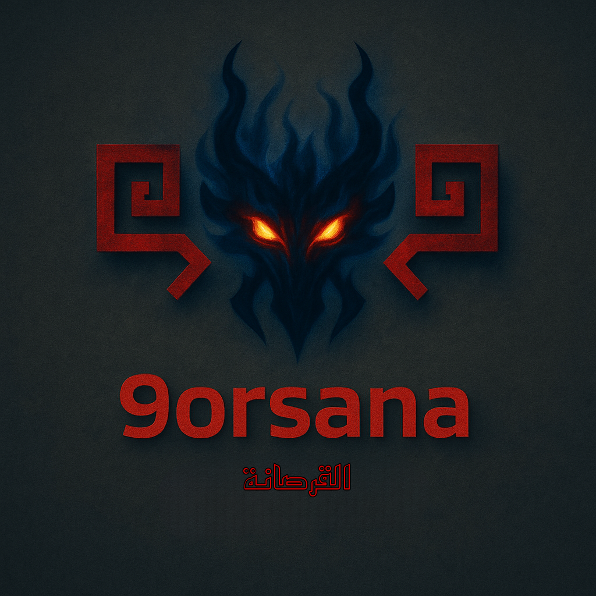

# 9orsana
<center></center>

### Key Innovations:

1. **9orsana Scanning Architecture**:
   - Single scanner for all languages and CMS platforms
   - Language-specific adapters (PHP, JS, Python, Java, GraphQL)
   - CMS auto-installation (WordPress/Joomla)

2. **DeepSeek AI Integration**:
   - Local API endpoint for vulnerability detection
   - AI-generated vulnerability reports
   - Context-aware scanning prompts

3. **Self-Improvement Capability**:
   - Pattern generation from AI findings
   - Automated scanner testing
   - Safe self-update mechanism
   - Continuous learning from scans

4. **Multi-Language Support**:
   - PHP (with CMS-specific enhancements)
   - JavaScript (client-side vulnerabilities)
   - Python (AST-based analysis)
   - Java (basic pattern matching)
   - GraphQL (query analysis)

5. **Advanced Features**:
   - Vulnerability chaining detection
   - Behavior profiling
   - Risk heatmap visualization
   - Entropy-based obfuscation detection
   - Sensitive data exposure scanning

### Installation Guide:

1. **Install Dependencies**:
```bash
# PHP required
sudo apt-get install php php-ast

# composer setup
curl -sS https://getcomposer.org/installer -o composer-setup.php
HASH="$(wget -q -O - https://composer.github.io/installer.sig)"
php -r "if (hash_file('SHA384', 'composer-setup.php') === '$HASH') { echo 'Installer verified'; } else { echo 'Installer corrupt'; unlink('composer-setup.php'); } echo PHP_EOL;"
sudo php composer-setup.php --install-dir=/usr/local/bin --filename=composer
php -r "unlink('composer-setup.php');"

# installing nikic/php-parser via composer 
composer require nikic/php-parser

# Python dependencies
pip install -r requirements.txt
# WP-CLI
curl -O https://raw.githubusercontent.com/wp-cli/builds/gh-pages/phar/wp-cli.phar
chmod +x wp-cli.phar
sudo mv wp-cli.phar /usr/local/bin/wp

# Joomla CLI
wget https://github.com/joomlatools/joomlatools-console/releases/download/v1.6.0/joomla.phar
chmod +x joomla.phar
sudo mv joomla.phar /usr/local/bin/joomla

#make build (direct pythoning 9orsana also still works
makepkg -si

# DeepSeek (using Ollama)
curl https://ollama.ai/install.sh | sh
ollama run deepseek-coder
```

2. **run 9orsana**:

**Scan WordPress plugin**:
```bash
python 9orsana.py --cms WordPress --plugin contact-form-7 -o report.json --self-update
```

**Scan local GraphQL API**:
```bash
python 9orsana.py --path ./graphql/schema.graphql -o graphql_report.json
```

**Scan Python web app**:
```bash
python 9orsana.py --path ./myapp --self-update
```


### Self-Improvement Process:

1. **Detection**:
   - AI finds vulnerability not covered by current patterns
   - Confidence exceeds threshold (80%)

2. **Pattern Generation**:
   - AI creates regex pattern for detection
   - Pattern tested on vulnerable file

3. **Scanner Update**:
   - Updated scanner tested with known vulnerability
   - If successful, scanner replaces itself
   - New pattern added to detection engine

### Sample Output:

```json
{
  "metadata": {
    "scanned_files": 27,
    "cms_type": "WordPress",
    "behavior_profile": {
      "SQLi": 2,
      "XSS": 3,
      "exposed_vulnerabilities": 4,
      "Obfuscated_Code": 1
    },
    "self_improvements": [
      {
        "vulnerability": "GraphQL_Injection",
        "language": "graphql",
        "pattern": "query\\s*\\{\\s*user\\(id:\\s*\\$.+?\\)",
        "source_file": "/plugins/myplugin/graphql/schema.graphql"
      }
    ]
  },
  "vulnerabilities": [
    {
      "type": "SQLi",
      "file": "/plugins/contact-form-7/includes/db.php",
      "line": 42,
      "confidence": 95,
      "description": "Unsafe SQL query construction with user input"
    },
    {
      "type": "GraphQL_Injection",
      "file": "/plugins/myplugin/graphql/schema.graphql",
      "confidence": 92,
      "description": "User input directly used in GraphQL query",
      "source": "AI"
    },
    {
      "type": "Chained_Vulnerability",
      "file": "/plugins/myplugin/upload.php",
      "confidence": 90,
      "description": "Chained vulnerabilities: File_Upload, LFI",
      "chain": ["File_Upload", "LFI"]
    }
  ],
  "files_scanned": [
    "/plugins/contact-form-7/contact-form-7.php",
    "/plugins/contact-form-7/includes/db.php",
    "/plugins/myplugin/graphql/schema.graphql",
    "/plugins/myplugin/upload.php"
  ]
}
```
### 📜 CMS Platforms with CLI Tools Supported
**soon we add the rest**

| CMS Name                                | Language   | CLI Tool                                        | CLI Location/Install                                  | Key CLI Features                                                                | Present |
|----------------------------------------|------------|--------------------------------------------------|--------------------------------------------------------|----------------------------------------------------------------------------------|---------|
| **WordPress**                           | PHP        | `WP-CLI`                                        | [wp-cli.org](https://wp-cli.org) – install separately  | Core/plugin/theme management, user/db control, multisite, updates, cron jobs    | ✅       |
| **Joomla**                              | PHP        | Built-in (J4+)                                  | Included in `cli/joomla.php`                           | Core/extension updates, user/config handling, maintenance, file cleanup         | ✅       |
| **Drupal**                              | PHP        | `Drush`                                         | Install via Composer                                   | Core updates, config import/export, cache, DB, cron, user & module management   | ❌       |
| **Magento (Adobe Commerce)**            | PHP        | `bin/magento`                                   | Comes with Magento install                             | Module/theme enable/disable, cache/index, upgrade, user/admin, DB export/import | ❌       |
| **Laravel-based CMS (e.g. OctoberCMS)** | PHP        | `artisan`                                       | Comes with Laravel apps                                | Migrations, models, components, plugin install, user/tasks                      | ❌       |
| **Typo3**                               | PHP        | `typo3` (Console)                               | Included / Composer                                    | Extensions, DB, backend user control, cache, upgrades                           | ❌       |
| **ConcreteCMS**                         | PHP        | `concrete/bin/concrete`                         | Included                                               | Install, cache clear, user/group mgmt, jobs, packages                           | ❌       |
| **Grav**                                | PHP        | `bin/gpm`, `bin/grav`                           | Included                                               | Plugin/theme mgmt, backups, cache, system checks                                | ❌       |
| **Craft CMS**                           | PHP        | `craft`                                         | Included                                               | Project config, DB backups, plugin mgmt, queue/job mgmt                         | ❌       |
| **Statamic**                            | PHP        | `php please`                                    | Included                                               | Content scaffolding, backups, plugin mgmt, data import                          | ❌       |
| **SilverStripe**                        | PHP        | `vendor/bin/sake` or `framework/cli-script.php` | Included / Composer                                    | Dev tasks, flush cache, DB rebuild, config                                      | ❌       |
| **Bolt CMS**                            | PHP        | `bin/console`                                   | Symfony Console                                        | DB schema update, users, cache clear, extensions                                | ❌       |
| **Plone**                               | Python     | `bin/instance`                                  | Included with buildout                                 | DB packing, migrations, user/permission control, install add-ons                | ❌       |
| **Ghost**                               | Node.js    | `ghost`                                         | Installed via `ghost-cli`                              | Install/update/start/stop blog instances, themes, users                         | ❌       |
| **Strapi**                              | Node.js    | `strapi`                                        | Comes with Strapi project                              | Scaffold API, start server, build admin panel, plugin mgmt                      | ❌       |
| **KeystoneJS**                          | Node.js    | `keystone`                                      | Part of Keystone package                               | Start server, manage data, generate schema, admin tasks                         | ❌       |
| **Directus**                            | Node.js    | `npx directus`                                  | Via `npm install` or `npx`                             | Start/stop project, DB migration, user roles, collection mgmt                   | ❌       |
| **Sanity**                              | JavaScript | `sanity`                                        | Via `npm install -g @sanity/cli`                       | Deploy, dataset export/import, auth, schema mgmt                                | ❌       |
| **Netlify CMS**                         | JavaScript | Git/CLI-driven                                  | Uses Git workflows                                     | Content via Git, CLI indirectly through Git commands                            | ❌       |

### Visual Outputs:

1. **Vulnerability Heatmap**:
   - `vulnerability_heatmap.png` shows risk distribution
   - Redder bars indicate higher-risk files


2. **Behavior Profile**:
   - Vulnerability type distribution
   - Exposure risk assessment
   - Security posture summary

9orsana scanner combines all our previous capabilities with AI-powered detection and self-improvement, creating a powerful tool that evolves with each scan. The CMS integration and multi-language support make it versatile for various security assessment scenarios.
